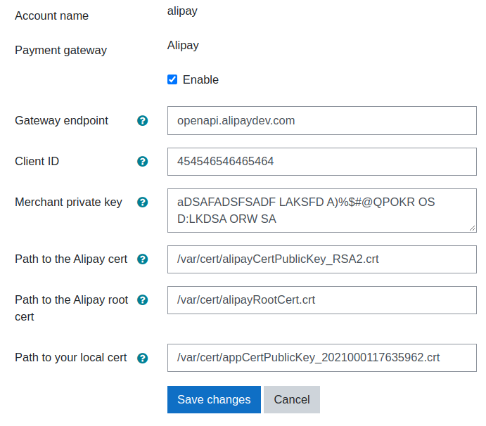

# Alipay  #

This plugin allows a site to connect to Alipay China using the PHP EasySDK available here:  
https://github.com/alipay/alipay-easysdk/tree/master/php  
  
Note: This SDK doesn't appear to support the Alipay Global site at this stage.

## Setup Alipay account ##
To set up access within Moodle you will need to:
* Generate an RSA key pair (Alipay have their own docs on this.)
* Create an application in the Alipay developer center
* Upload your public RSA key to Alipay 
* Download the Alipay cert and root cert to use within Moodle

## Configure Moodle
* Go to site administration / Plugins / Manage payment gateways and enable the Alipay payment gateway.
* Go to site administration / Payments / Payment accounts
* Click the button 'Create payment account' then enter an account name for identifying it when setting up enrolment on payment, then save changes.
* On the Payment accounts page, click the payment gateway link to configure Alipay.
* In the configuration page, 
    * Enter your clientid from the application you have created in the alipay developer centre
    * Paste your own private key value from the RSA key you created above into the merchant private key field.
    * Put the alipay public cert/root cert and your local cert file accessible somewhere on your server and put the full path to these files in the fields.
      
      
## Add Enrolment on payment.
* Go to Go to Site administration > Plugins > Enrolments > Manage enrol plugins and click the eye icon opposite Enrolment on payment.
* Click the settings link, configure as required then click the 'Save changes' button.
* Go to the course you wish to enable payment for, and add the 'Enrolment on payment' enrolment method to the course.
* Select a payment account, amend the enrolment fee as necessary then click the button 'Add method'.

see also:  
[moodledocs: Payment Gateways](https://docs.moodle.org/en/Payment_gateways)  
[moodledocs: Enrolment on Payment](https://docs.moodle.org/en/Enrolment_on_payment)

## License ##

2021 Catalyst IT

This program is free software: you can redistribute it and/or modify it under
the terms of the GNU General Public License as published by the Free Software
Foundation, either version 3 of the License, or (at your option) any later
version.

This program is distributed in the hope that it will be useful, but WITHOUT ANY
WARRANTY; without even the implied warranty of MERCHANTABILITY or FITNESS FOR A
PARTICULAR PURPOSE.  See the GNU General Public License for more details.

You should have received a copy of the GNU General Public License along with
this program.  If not, see <https://www.gnu.org/licenses/>.
